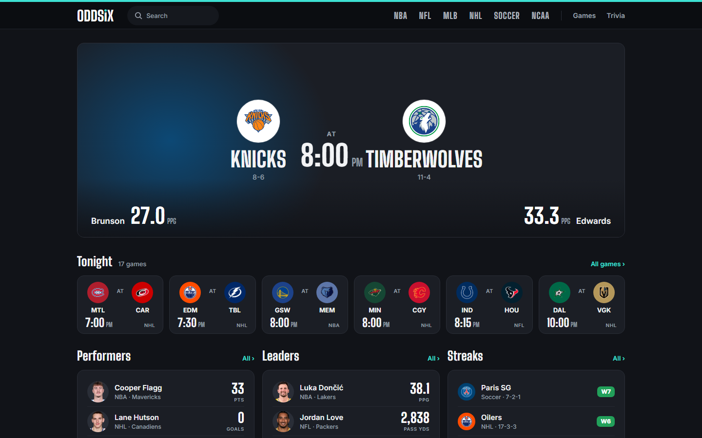
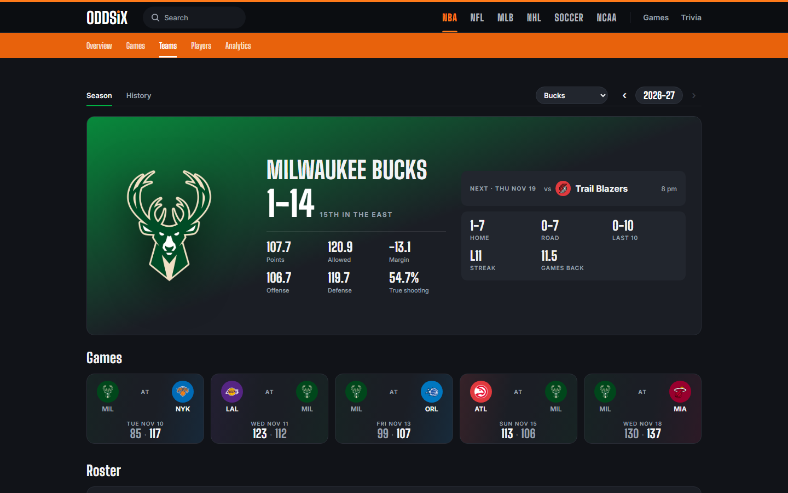
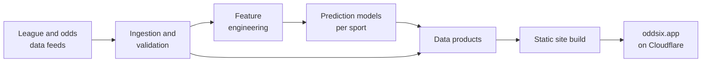

# Oddsix

A multi-sport data and prediction platform, live at **[oddsix.app](https://oddsix.app)**.
Designed, built and run by Spencer Goss. The source code is private; this repository documents the project.

<b>Home.</b> The front door to every league on the site.

## A tour of the site

Click any picture to open that page live.

<table>
<tr>
<td width="50%"> <b>League overview.</b> Tonight's games, last night's scores, standings, stat leaders and player of the week.</td>
<td width="50%"> <b>Team page.</b> Record, splits, recent games, efficiency stats and the full roster.</td>
</tr>
<tr>
<td width="50%"> <b>Player page.</b> Season and career stats, game logs and shot data. One template serves about 57,000 players.</td>
<td width="50%"> <b>Daily trivia.</b> Games like Higher or Lower and Grid Fill, built on the same data.</td>
</tr>
</table>

## By the numbers

| | |
|---|---|
| Leagues live | 5 (NBA, NFL, MLB, NHL, soccer) |
| Player pages | about 57,000 |
| History | 25+ years plus the current season |
| Updates | continuously through the day |

## Features

- Live scores, standings and game pages for the NBA, NFL, MLB, NHL and soccer
- League overview pages: tonight's games, last night's scores, standings, stat leaders and player of the week
- Team pages with records, splits, recent games, efficiency stats and rosters
- Season and career stats, game logs and shot data for about 57,000 players
- Historical record books for each league
- Daily sports trivia games built on the same data (Higher or Lower, Beat the Clock, Grid Fill and more)
- A prediction model for each sport; a new generation of models is in live testing this season

## Architecture

```mermaid
flowchart LR
    A[League and odds<br/>data feeds] --> B[Ingestion and<br/>validation]
    B --> C[Feature<br/>engineering]
    C --> D[Prediction models<br/>per sport]
    D --> E[Data products]
    B --> E
    E --> F[Static site build]
    F --> G[oddsix.app<br/>on Cloudflare]
```

- **Data:** league APIs and public odds feeds, ingested and validated continuously through the day
- **Storage:** relational databases and versioned data files, with large archives on Cloudflare R2
- **Models:** a separate model per sport, validated on seasons they were not trained on, with calibrated probabilities
- **Front end:** Astro static site on Cloudflare Pages, with one template serving every player page

## Stack

Python (pandas, scikit-learn, LightGBM) · SQL · Astro · TypeScript · Cloudflare Pages and R2

---

For information and entertainment only.
